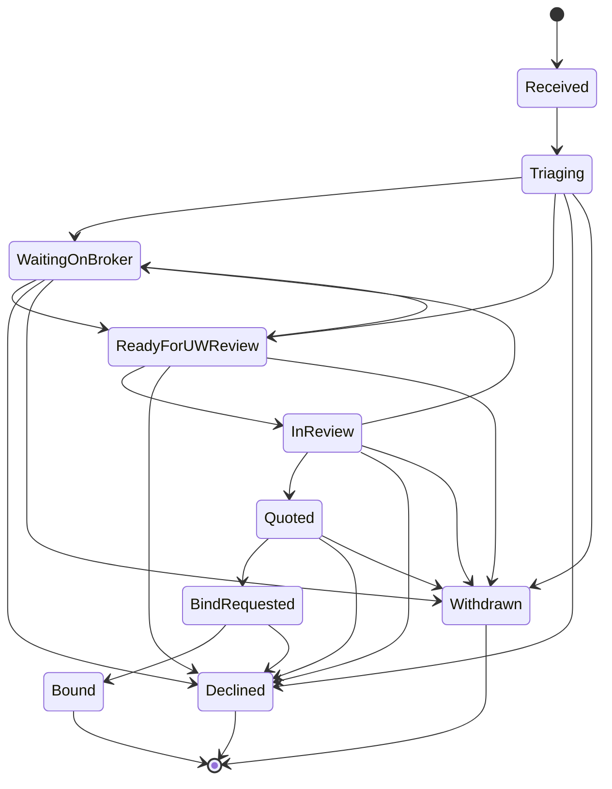

# Workflow Specification: [Workflow Name]

**Entity:** [Entity this workflow applies to, e.g., Submission, Renewal]

**Workflow Type:** [Status-based | Approval | Lifecycle]

**Owner Module:** [Module responsible for this workflow]

---

## Overview

[Brief description of what this workflow manages and its business purpose]

**Example:**
> The Submission workflow manages the lifecycle of insurance quote requests from initial receipt through binding or declination. It ensures proper review, underwriting, and broker communication at each stage.

---

## States

List all possible states in this workflow.

| State | Description | Type | Can Edit? |
|-------|-------------|------|-----------|
| [StateName] | [What this state means] | [Initial\|Active\|Terminal] | [Yes\|No] |

**State Types:**
- **Initial:** Entry point state (automatically assigned on creation)
- **Active:** Normal workflow state where work is performed
- **Terminal:** End state (no transitions allowed from here)

**Example:**
| State | Description | Type | Can Edit? |
|-------|-------------|------|-----------|
| Received | Submission received, not yet reviewed | Initial | Yes |
| Triaging | Being reviewed by distribution team | Active | Yes |
| WaitingOnBroker | Incomplete, waiting for broker information | Active | Yes |
| ReadyForUWReview | Complete and ready for underwriter | Active | Yes |
| InReview | Underwriter is reviewing | Active | Yes |
| Quoted | Quote has been generated and sent to broker | Active | Yes |
| BindRequested | Broker has accepted quote and requested bind | Active | Yes |
| Bound | Policy has been issued | Terminal | No |
| Declined | Submission was declined | Terminal | No |
| Withdrawn | Broker withdrew the submission | Terminal | No |

---

## State Diagram

[Visual representation of the workflow - use Mermaid syntax or ASCII art]

**Mermaid Example:**


**ASCII Art Alternative:**
```
[Received] ─┐
            ├─> [Triaging] ─┬─> [WaitingOnBroker] ─┐
            │               ├─> [ReadyForUWReview] ─┤
            │               ├─> [Declined*]         │
            │               └─> [Withdrawn*]        │
            │                                        │
            └──────────────────────────<─────────────┘
                                        │
                                        ├─> [InReview] ─┬─> [Quoted] ─┬─> [BindRequested] ─> [Bound*]
                                        │               │              ├─> [Declined*]
                                        │               │              └─> [Withdrawn*]
                                        │               ├─> [WaitingOnBroker] (loop back)
                                        │               ├─> [Declined*]
                                        │               └─> [Withdrawn*]

* = Terminal state (no further transitions)
```

---

## Allowed Transitions

Define all valid state transitions with their requirements and effects.

### Format

```markdown
**From [SourceState] → To [TargetState]**

**Trigger:** [What causes this transition - user action, system event, etc.]

**Prerequisites:**
- [ ] [Condition that must be true]
- [ ] [Required field or data]

**Authorization:**
- Roles: [List of roles allowed to perform this transition]
- Permissions: [Specific permission required]
- Additional: [Any additional authorization rules]

**Validation:**
- [Validation rule 1]
- [Validation rule 2]

**Side Effects:**
- [What else happens when this transition occurs]

**Error Response (if invalid):**
```json
{
  "code": "ERROR_CODE",
  "message": "Error message"
}
```
```

### Example Transitions

**From Triaging → To ReadyForUWReview**

**Trigger:** User clicks "Ready for UW Review" button

**Prerequisites:**
- [ ] All required fields are populated (insuredName, coverageType, effectiveDate, program, broker)
- [ ] Exposure details are complete
- [ ] At least one document is attached

**Authorization:**
- Roles: Distribution, RelationshipManager, Admin
- Permissions: `TransitionSubmission`
- Additional: None

**Validation:**
- InsuredName must not be empty
- CoverageType must be selected from valid options
- EffectiveDate must be in the future
- Program must be assigned
- Broker must be assigned

**Side Effects:**
- WorkflowTransition event created
- ActivityTimelineEvent "Submission marked ready for review" created
- Notification sent to underwriters (if notification system enabled)

**Error Response (if invalid):**
```json
{
  "code": "MISSING_REQUIRED_FIELDS",
  "message": "Cannot transition to ReadyForUWReview. Missing required fields.",
  "details": [
    { "field": "insuredName", "message": "Insured name is required" },
    { "field": "program", "message": "Program must be selected" }
  ]
}
```

---

**From InReview → To Quoted**

**Trigger:** Underwriter generates a quote

**Prerequisites:**
- [ ] Quote amount is populated
- [ ] Quote terms are documented
- [ ] Premium breakdown is complete
- [ ] Underwriter is assigned

**Authorization:**
- Roles: Underwriter, Admin
- Permissions: `TransitionSubmission`, `GenerateQuote`
- Additional: Underwriter must be the assigned underwriter OR user must be Admin

**Validation:**
- QuoteAmount must be > 0
- QuoteExpirationDate must be in the future
- Premium breakdown must total to QuoteAmount

**Side Effects:**
- WorkflowTransition event created
- ActivityTimelineEvent "Quote generated" created
- Quote document generated and attached
- Email sent to broker with quote details
- QuotedAt timestamp set

**Error Response (if invalid):**
```json
{
  "code": "INVALID_QUOTE",
  "message": "Cannot generate quote with invalid data.",
  "details": [
    { "field": "quoteAmount", "message": "Quote amount must be greater than zero" }
  ]
}
```

---

## Blocked Transitions

Define transitions that are explicitly NOT allowed and why.

**Format:**
```markdown
**From [SourceState] → To [TargetState]** ❌

**Reason:** [Why this transition is not allowed]

**Error Response:**
```json
{
  "code": "INVALID_TRANSITION",
  "message": "Cannot transition from [SourceState] to [TargetState]",
  "details": {
    "currentStatus": "[SourceState]",
    "attemptedStatus": "[TargetState]",
    "allowedStatuses": ["[ValidState1]", "[ValidState2]"]
  }
}
```
```

**Example:**
**From Bound → To any other state** ❌

**Reason:** Once a policy is bound, the submission is finalized and cannot be changed. Any modifications require creating a new endorsement or renewal.

**Error Response:**
```json
{
  "code": "INVALID_TRANSITION",
  "message": "Cannot transition from Bound status. Submission is finalized.",
  "details": {
    "currentStatus": "Bound",
    "attemptedStatus": "InReview",
    "allowedStatuses": []
  }
}
```

---

## Required Fields by State

Define which fields must be populated before entering each state.

| State | Required Fields |
|-------|----------------|
| [StateName] | [List of required fields] |

**Example:**
| State | Required Fields |
|-------|----------------|
| Received | EffectiveDate, BrokerId |
| Triaging | All Received fields + InsuredName, CoverageType |
| ReadyForUWReview | All Triaging fields + Program, ExposureDetails, Documents |
| InReview | All ReadyForUWReview fields + AssignedUnderwriter |
| Quoted | All InReview fields + QuoteAmount, QuoteTerms, QuoteExpirationDate |
| BindRequested | All Quoted fields + PaymentInfo, BrokerAcceptance |
| Bound | All BindRequested fields + PolicyNumber, BoundAt |

---

## State Behavior

Define specific behaviors or rules for each state.

### [StateName]

**Can Edit Entity:** [Yes | No | Conditional]

**Editable Fields:** [List of fields that can be edited in this state]

**Read-Only Fields:** [List of fields that become read-only in this state]

**Auto-Actions:** [Any automatic actions that occur when entering this state]

**User Actions Available:** [List of actions users can perform]

**Example:**

### Triaging

**Can Edit Entity:** Yes

**Editable Fields:** InsuredName, CoverageType, EffectiveDate, ExposureDetails, Program, Broker, Documents

**Read-Only Fields:** SubmissionNumber, ReceivedAt

**Auto-Actions:**
- TriagedAt timestamp is set when entering this state
- "Submission triaging started" timeline event created

**User Actions Available:**
- Edit submission details
- Upload/remove documents
- Transition to ReadyForUWReview
- Transition to WaitingOnBroker
- Transition to Declined (with reason)
- Transition to Withdrawn (with reason)

---

### Bound

**Can Edit Entity:** No

**Editable Fields:** None (read-only)

**Read-Only Fields:** All fields

**Auto-Actions:**
- BoundAt timestamp is set
- PolicyNumber is generated (if not already set)
- "Submission bound" timeline event created
- Policy document generated
- Email sent to broker with policy details
- Premium calculation finalized

**User Actions Available:**
- View submission (read-only)
- Download policy document
- View audit history

---

## Workflow Transition Event

Every state transition creates an immutable WorkflowTransition record.

### Schema

```json
{
  "id": "uuid",
  "entityType": "Submission",
  "entityId": "uuid",
  "fromStatus": "string",
  "toStatus": "string",
  "transitionedAt": "datetime (UTC)",
  "transitionedBy": "uuid (userId)",
  "reason": "string (nullable, required for certain transitions)",
  "metadata": {
    // Additional context-specific data
  }
}
```

### Required Reason

Some transitions require a reason to be provided:
- Declined (decline reason)
- Withdrawn (withdrawal reason)
- WaitingOnBroker (what information is missing)

---

## Authorization Rules

Define role-based permissions for workflow transitions.

| Role | Can Transition From | Can Transition To |
|------|-------------------|------------------|
| [RoleName] | [States] | [States] |

**Example:**
| Role | Can Transition From | Can Transition To |
|------|-------------------|------------------|
| Distribution | Triaging, WaitingOnBroker | ReadyForUWReview, WaitingOnBroker, Declined, Withdrawn |
| Underwriter | ReadyForUWReview, InReview, Quoted | InReview, Quoted, WaitingOnBroker, Declined, Withdrawn |
| Underwriter | BindRequested | Bound, Declined |
| Admin | Any state | Any allowed state |

**Additional Rules:**
- Underwriters can only transition submissions assigned to them (except Admins)
- Distribution users cannot perform underwriting transitions (InReview → Quoted)

---

## Performance Considerations

Define performance expectations for workflow operations.

- **Transition latency:** < 500ms per transition
- **Concurrent transitions:** System must handle concurrent transition attempts gracefully (use optimistic locking)
- **State queries:** List endpoints should filter by status efficiently (indexed)
- **Audit queries:** Workflow transition history queries should be performant (separate timeline table)

---

## Testing Requirements

Define what must be tested for this workflow.

**Unit Tests:**
- [ ] Each allowed transition succeeds with valid data
- [ ] Each blocked transition returns 409 Conflict
- [ ] Required field validation prevents invalid transitions
- [ ] Authorization rules are enforced

**Integration Tests:**
- [ ] WorkflowTransition events are created for all transitions
- [ ] ActivityTimelineEvents are created with correct descriptions
- [ ] Side effects (emails, notifications) are triggered
- [ ] Optimistic locking prevents concurrent transitions

**End-to-End Tests:**
- [ ] Complete happy path (Received → Bound)
- [ ] Declination path (any state → Declined)
- [ ] Withdrawal path (any state → Withdrawn)
- [ ] Return to WaitingOnBroker and back to ReadyForUWReview

---

## Error Codes

Standard error codes for workflow operations.

| Code | HTTP Status | Description |
|------|-------------|-------------|
| `INVALID_TRANSITION` | 409 Conflict | Attempted transition is not allowed from current state |
| `MISSING_REQUIRED_FIELDS` | 400 Bad Request | Required fields not populated for target state |
| `UNAUTHORIZED_TRANSITION` | 403 Forbidden | User doesn't have permission to perform transition |
| `CONCURRENT_MODIFICATION` | 409 Conflict | Entity was modified by another user (optimistic locking) |
| `WORKFLOW_ERROR` | 500 Internal Server Error | Unexpected error during transition |

---

## Future Enhancements

Document potential future workflow enhancements (not in MVP).

- [ ] Automated transitions based on time or events
- [ ] Parallel approval workflows
- [ ] Workflow customization per program or MGA
- [ ] Workflow analytics (average time in each state)
- [ ] Workflow SLA tracking and alerts

---

## Related Documentation

- API Contract: [Link to OpenAPI spec for this entity]
- Data Model: [Link to entity model specification]
- User Stories: [Links to relevant user stories]
- ADRs: [Links to related architectural decisions]

---

## Version History

**Version 1.0** - 2026-01-26 - Initial workflow specification template

---

## Template Instructions

1. Copy this template for each workflow in the system
2. Replace all bracketed placeholders with actual content
3. Save to `planning-mds/workflows/[entity-name]-workflow.md`
4. Reference from INCEPTION.md Section 4.3 (Workflow Rules)
5. Keep workflow specs updated as business rules evolve

**Delete this instructions section before committing.**
