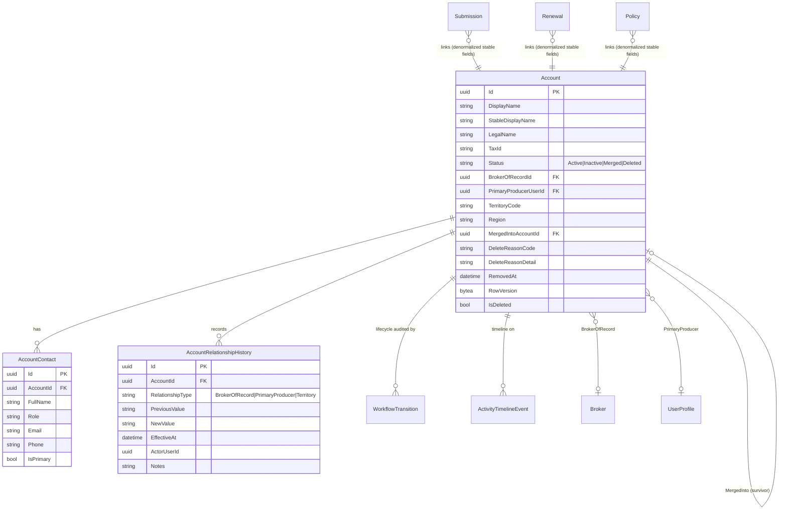

# F0016 — Account 360 & Insured Management

**Status:** In Refinement
**Priority:** Critical
**Phase:** CRM Release MVP

## Overview

Add insured-centered Account records and a composed Account 360 workspace so underwriters, distribution users, and distribution managers can view related contacts, submissions, policies, renewals, and activity in one place.

F0016 also owns the **Deleted / Merged Account Fallback Contract** so submission, policy, renewal, timeline, and search views continue to render predictably when an account is deactivated, merged, or deleted.

## Documents

| Document | Purpose |
|----------|---------|
| [PRD.md](./PRD.md) | Product scope, workflow, stories, business outcomes |
| [STATUS.md](./STATUS.md) | Planning and implementation tracker + signoff matrix |
| [GETTING-STARTED.md](./GETTING-STARTED.md) | Setup and refinement notes |
| [feature-assembly-plan.md](./feature-assembly-plan.md) | Architect's build plan: migrations, entities, DTOs, services, endpoints |
| [ADR-017](../../architecture/decisions/ADR-017-account-merge-tombstone-and-fallback-contract.md) | Account merge, tombstone, and dependent-view fallback contract |

## Architecture

### Entity Relationship Diagram



### System Context (C4 — Container View)

```mermaid
graph TB
    User[Underwriter / Distribution User / Manager]
    FE[Nebula Web UI<br/>Account 360, list, merge flow]
    API[Nebula API<br/>/accounts/**, /accounts/{id}/summary, /accounts/{id}/timeline]
    DB[(PostgreSQL<br/>Accounts, AccountContacts,<br/>AccountRelationshipHistory,<br/>WorkflowTransitions,<br/>ActivityTimelineEvents)]
    Casbin[Casbin ABAC<br/>account:* policy rules]
    Authentik[Authentik OIDC<br/>Roles + scopes]
    SubAPI[Submissions API<br/>F0006 — dependent]
    RenAPI[Renewals API<br/>F0007 — dependent]
    PolStub[Policy Stub<br/>F0007-seeded; F0018 extends]
    Timeline[Shared ActivityTimelineEvent<br/>ADR-011]

    User --> FE
    FE --> API
    API --> Casbin
    API --> DB
    API --> Timeline
    FE --> SubAPI
    FE --> RenAPI
    API -. read for 360 .-> SubAPI
    API -. read for 360 .-> RenAPI
    API -. read for 360 .-> PolStub
    User -. authn .-> Authentik
    FE -. bearer token .-> API
```

### Account Lifecycle State Machine

```
Active ⇄ Inactive
  │         │
  └────────┴────► Merged  (requires survivorAccountId; survivor must be Active; role: DistributionManager | Admin)
  └────────┴────► Deleted (requires reasonCode; role: DistributionManager | Admin)

Merged and Deleted are terminal-for-writes. Unmerge / undelete: Future.
```

See [ADR-017](../../architecture/decisions/ADR-017-account-merge-tombstone-and-fallback-contract.md) for the full merge + tombstone + fallback contract.

## Stories

| ID | Title | Status |
|----|-------|--------|
| F0016-S0001 | [Account list with search and filtering](./F0016-S0001-account-list-with-search-and-filtering.md) | Draft |
| F0016-S0002 | [Create account (manual and from submission / policy)](./F0016-S0002-create-account.md) | Draft |
| F0016-S0003 | [Account detail and profile edit](./F0016-S0003-account-detail-and-profile-edit.md) | Draft |
| F0016-S0004 | [Account 360 composed workspace](./F0016-S0004-account-360-composition.md) | Draft |
| F0016-S0005 | [Account-scoped contacts management](./F0016-S0005-account-contacts-management.md) | Draft |
| F0016-S0006 | [Account relationships (broker / producer / territory)](./F0016-S0006-account-relationships-broker-producer-territory.md) | Draft |
| F0016-S0007 | [Account lifecycle (deactivate / reactivate / delete)](./F0016-S0007-account-lifecycle-deactivate-reactivate-delete.md) | Draft |
| F0016-S0008 | [Account merge and duplicate handling](./F0016-S0008-account-merge-and-duplicate-handling.md) | Draft |
| F0016-S0009 | [Deleted / merged account fallback contract](./F0016-S0009-deleted-merged-account-fallback-contract.md) | Draft |
| F0016-S0010 | [Account activity timeline and audit trail](./F0016-S0010-account-activity-timeline-and-audit.md) | Draft |
| F0016-S0011 | [Account summary projection](./F0016-S0011-account-summary-projection.md) | Draft |

**Total Stories:** 11
**Completed:** 0 / 11
